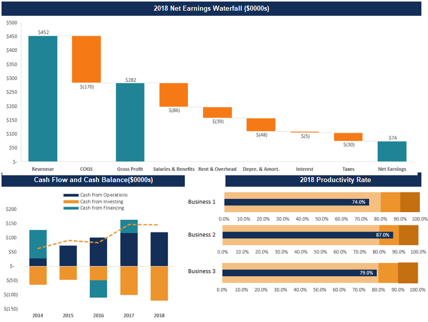

# Net Earnings Summary
### The Net Earnings in year 2008 using the waterfall charts showing the Revenue, Gross Profit and Net earnings
### The Cash Flow and Cash Balance charts showing cash from operations, cash from investing and cash from financing using a combo chart
### Productivity Rate in 2018 across various business levels showing their percentage rate using bullet chart

